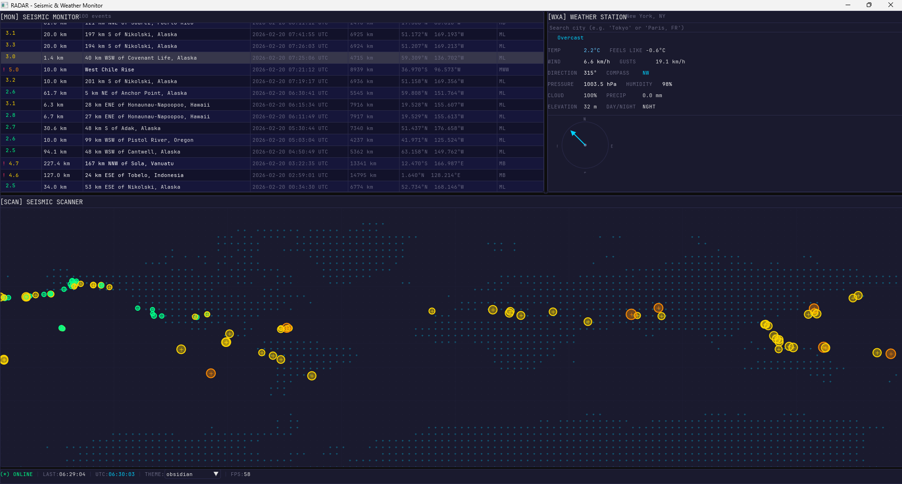
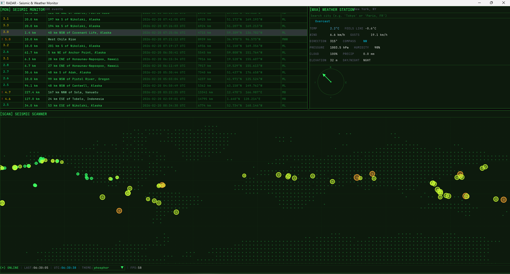
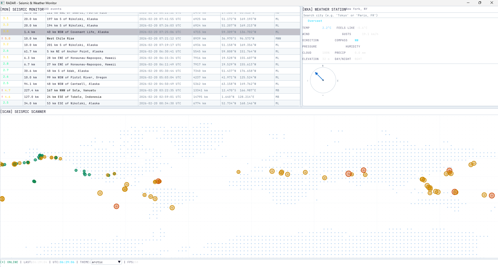
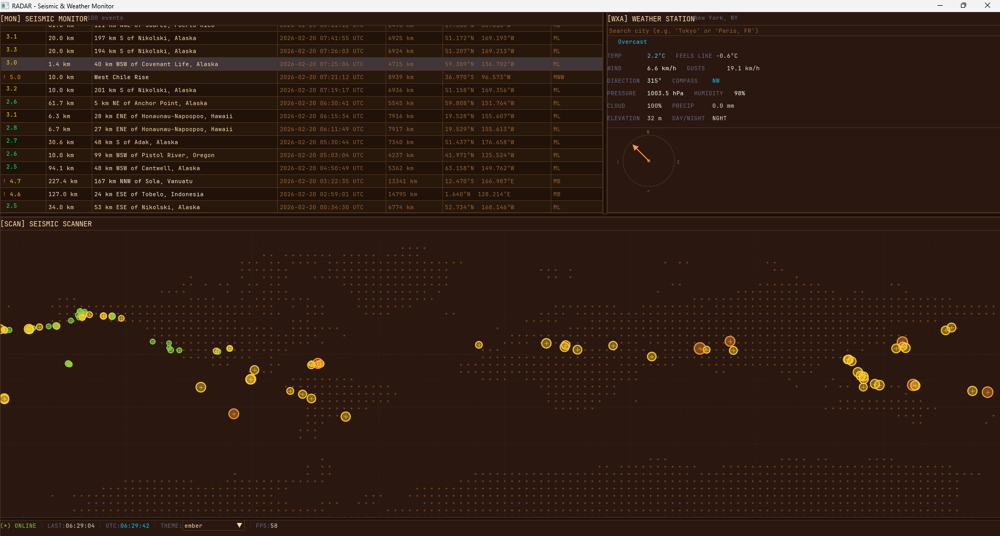
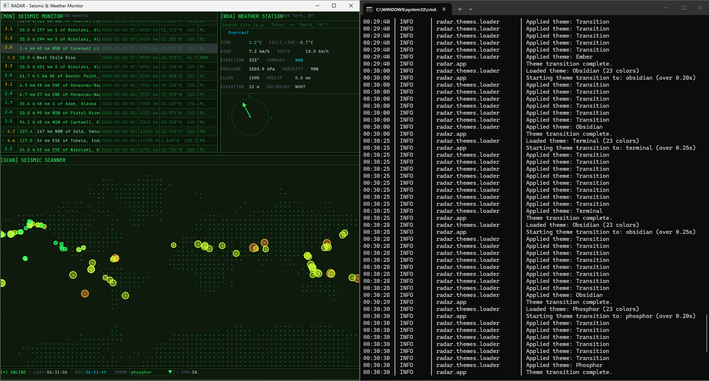

<div align="center">

# 🛰️ RADAR

**Real-Time Earthquake & Weather Monitoring Dashboard**

A cross-platform desktop application with a TUI-inspired aesthetic, built for performance and clarity.

[](https://python.org)
[](https://pyo3.rs)
[](https://cffi.readthedocs.io)
[](LICENSE)
[](https://github.com/hoffstadt/DearPyGui)
[]()

---

*A scientific monitoring station. A disaster response console. A polished command center.*

<!-- DEMO PLACEHOLDER -->
<!-- Replace with animated GIF/video of the running application -->
<!--  -->

</div>

---

## Features

| Category | Details |
|---|---|
| **Seismic Monitor** | Live earthquake feed from USGS — magnitude, depth, location, coordinates, timestamps |
| **Weather Station** | Real-time weather from Open-Meteo — temperature, wind, pressure, humidity, cloud cover |
| **Seismic Map** | Mercator-projected world map with magnitude-coded earthquake plotting |
| **Theme Engine** | 4 built-in themes (Obsidian, Phosphor, Arctic, Ember) — JSON-configurable, hot-reloadable |
| **Performance** | Rust extension for fast JSON parsing, C extension for signal smoothing |
| **Architecture** | Non-blocking async data fetching, diff-based UI updates, zero flicker |

---

## Screenshots

| Obsidian (Default) | Phosphor (CRT) |
|---|---|
|  |  |

| Arctic (Light) | Ember (Warm) |
|---|---|
|  |  |

### Dashboard Overview


---

## Quick Start

```bash
# Clone
git clone https://github.com/yourusername/radar.git
cd radar

# Install
pip install -e .

# Run
python -m radar
```

> **No API keys required.** Both USGS and Open-Meteo are free public APIs.

See [INSTALL.md](INSTALL.md) for full setup instructions including Rust/C extensions.

---

## Configuration

All settings live in `config.toml` at the project root:

```toml
[general]
log_level = "INFO"
units = "metric"            # "metric" or "imperial"

[earthquake]
feed = "all_hour"           # all_hour, 2.5_day, significant_week, etc.
poll_interval = 60          # seconds (minimum 30)
highlight_threshold = 4.5   # magnitude threshold for event highlighting

[weather]
latitude = 29.7604          # your location
longitude = -95.3698
location_name = "Houston, TX"
poll_interval = 120         # seconds (minimum 60)

[ui]
theme = "obsidian"          # obsidian, phosphor, arctic, ember
font_size = 15
animations = true
```

### Available USGS Feeds

| Feed | Description |
|---|---|
| `all_hour` | All earthquakes, past hour |
| `all_day` | All earthquakes, past 24 hours |
| `2.5_day` | M2.5+ earthquakes, past 24 hours |
| `4.5_week` | M4.5+ earthquakes, past 7 days |
| `significant_month` | Significant earthquakes, past 30 days |

---

## Theme Creation Guide

Themes are JSON files in the `themes/` directory. Create a new file (e.g., `mytheme.json`):

```json
{
  "name": "My Theme",
  "description": "Custom theme description",
  "colors": {
    "background":    "#0D0D0D",
    "surface":       "#1A1A2E",
    "primary":       "#00D4FF",
    "accent":        "#FF6B35",
    "text":          "#E0E0E0",
    "text_dim":      "#666680",
    "text_bright":   "#FFFFFF",
    "success":       "#00FF88",
    "warning":       "#FFD700",
    "danger":        "#FF3366",
    "border":        "#2A2A4A",
    "header":        "#0F0F1E",
    "row_even":      "#12122A",
    "row_odd":       "#16163A",
    "magnitude_low":    "#00FF88",
    "magnitude_mid":    "#FFD700",
    "magnitude_high":   "#FF8C00",
    "magnitude_severe": "#FF3366"
  },
  "borders": { "style": "thin", "radius": 4, "thickness": 1 },
  "animation": {
    "transition_ms": 200,
    "fade_ms": 150,
    "pulse_ms": 1200,
    "highlight_decay_ms": 3000
  },
  "typography": { "font_size": 15, "line_spacing": 1.4, "header_scale": 1.3 }
}
```

**Hot-reload:** Edit and save any theme file while the app is running. Changes appear within ~2 seconds. Set `theme = "mytheme"` in `config.toml` to use your custom theme.

### Color Keys Reference

| Key | Purpose |
|---|---|
| `background` | Main window background |
| `surface` / `surface_alt` | Panel backgrounds |
| `primary` | Primary accent (clock, highlights, active elements) |
| `accent` | Secondary accent (buttons, active states) |
| `text` / `text_dim` / `text_bright` | Text hierarchy |
| `success` / `warning` / `danger` | Status indicators |
| `border` / `border_focus` | Panel and input borders |
| `magnitude_low/mid/high/severe` | Earthquake severity coloring (< 3, < 5, < 7, ≥ 7) |

---

## Architecture

```
┌──────────────────────────────────────────────────┐
│                  UI Layer (DearPyGui)            │
│  ┌──────────┐ ┌──────────┐ ┌──────┐ ┌─────────┐  │
│  │ EQ Panel │ │ WX Panel │ │ Map  │ │ Status  │  │
│  └────┬─────┘ └────┬─────┘ └───┬──┘ └────┬────┘  │
├───────┼──────────────┼─────────┼─────────┼───────┤
│       │    Thread-Safe Queue   │         │       │
├───────┼──────────────┼─────────┼─────────┼───────┤
│  ┌────┴─────┐  ┌─────┴────┐                      │
│  │ EQ Fetch │  │ WX Fetch │    Async Thread      │
│  └────┬─────┘  └─────┬────┘                      │
├───────┼──────────────┼───────────────────────────┤
│  ┌────┴──────────────┴────┐  ┌─────────────────┐ │
│  │  Rust Accel (optional) │  │ C Signal (opt.) │ │
│  └────────────────────────┘  └─────────────────┘ │
└──────────────────────────────────────────────────┘
```

---

## Project Structure

```
Radar/
├── pyproject.toml              # Build configuration
├── config.toml                 # User settings
├── themes/                     # JSON theme files (hot-reloadable)
│   ├── obsidian.json
│   ├── phosphor.json
│   ├── arctic.json
│   └── ember.json
├── src/radar/                  # Python package
│   ├── app.py                  # Main orchestrator
│   ├── config.py               # Config loader + validation
│   ├── data/                   # Async data fetchers
│   │   ├── earthquake.py       # USGS GeoJSON + diff engine
│   │   └── weather.py          # Open-Meteo + unit conversion
│   ├── ui/                     # DearPyGui panels
│   │   ├── viewport.py         # Window + font setup
│   │   ├── animations.py       # Lerp, easing, pulse
│   │   └── panels/             # Individual panel components
│   └── themes/                 # Theme loader + file watcher
├── rust/radar_accel/           # Rust PyO3 extension
│   └── src/lib.rs              # Fast JSON parsing + filtering
├── c_ext/                      # C signal processing extension
│   ├── radar_signal.c          # EMA / WMA smoothing
│   └── build_c.py              # cffi build script
└── tests/                      # Pytest test suite
```

---

## Roadmap

- [x] Core earthquake monitoring with USGS feed
- [x] Real-time weather integration with Open-Meteo
- [x] Simplified world map visualization
- [x] Theme system with 4 built-in themes
- [x] Theme hot-reload via file watcher
- [x] Rust accelerator module (PyO3)
- [x] C signal processing module (cffi)
- [X] Better maps (or a image of one)
- [ ] Forecast panel (zoom into region)
- [ ] Historical data graphing
- [ ] Alert system (sound + notification for threshold events)
- [ ] Multiple weather station tracking
- [ ] Plugin system for custom data sources
- [ ] Export data (CSV / JSON)
- [ ] Packaging (PyInstaller / Nuitka)

---

## Contributing

Contributions are welcome! Please:

1. Fork the repository
2. Create a feature branch (`git checkout -b feature/amazing-thing`)
3. Write tests for your changes
4. Ensure `pytest tests/ -v` passes
5. Submit a Pull Request

### Development Setup

```bash
pip install -e ".[dev]"
pytest tests/ -v
ruff check src/
mypy src/
```

---

## License

This project is licensed under the MIT License. See [LICENSE](LICENSE) for details.

